* Table of Contents
{:toc}
  
--------------------------------------------------------------------------------------------------------------------

## **Introduction**

This developer guide is meant for developers who wish to understand the internal workings of ModuleBook3.5. 

--------------------------------------------------------------------------------------------------------------------

## **Setting up, getting started**

Refer to the guide [_Setting up and getting started_](SettingUp.md).

--------------------------------------------------------------------------------------------------------------------

## **Design**

### Architecture

The ***Architecture Diagram*** given above explains the high-level design of the App. Given below is a quick overview of each component.

:bulb: **Tip:** The `.puml` files used to create diagrams in this document can be found in the [diagrams](https://github.com/se-edu/modulebook-level3/tree/master/docs/diagrams/) folder. Refer to the [_PlantUML Tutorial_ at se-edu/guides](https://se-education.org/guides/tutorials/plantUml.html) to learn how to create and edit diagrams.

**`Main`** has two classes called [`Main`](https://github.com/se-edu/modulebook-level3/tree/master/src/main/java/seedu/module/Main.java) and [`MainApp`](https://github.com/se-edu/modulebook-level3/tree/master/src/main/java/seedu/module/MainApp.java). It is responsible for,
* At app launch: Initializes the components in the correct sequence, and connects them up with each other.
* At shut down: Shuts down the components and invokes cleanup methods where necessary.

[**`Commons`**](#common-classes) represents a collection of classes used by multiple other components.

The rest of the App consists of four components.

* [**`UI`**](#ui-component): The UI of the App.
* [**`Logic`**](#logic-component): The command executor.
* [**`Model`**](#model-component): Holds the data of the App in memory.
* [**`Storage`**](#storage-component): Reads data from, and writes data to, the hard disk.

Each of the four components,

* defines its *API* in an `interface` with the same name as the Component.
* exposes its functionality using a concrete `{Component Name}Manager` class (which implements the corresponding API `interface` mentioned in the previous point.

For example, the `Logic` component (see the class diagram given below) defines its API in the `Logic.java` interface and exposes its functionality using the `LogicManager.java` class which implements the `Logic` interface.

**How the architecture components interact with each other**

The *Sequence Diagram* below shows how the components interact with each other for the scenario where the user issues the command `delete 1`.

The sections below give more details of each component.

### UI component

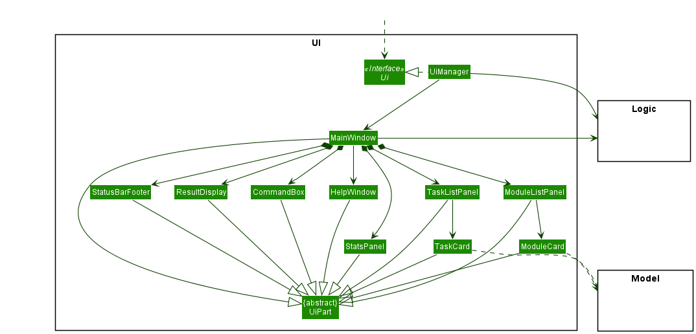

**API** :
[`Ui.java`](https://github.com/se-edu/modulebook-level3/tree/master/src/main/java/seedu/module/ui/Ui.java)

The UI consists of a `MainWindow` that is made up of parts e.g.`CommandBox`, `ResultDisplay`, `TaskListPanel`, `StatusBarFooter` etc. All these, including the `MainWindow`, inherit from the abstract `UiPart` class.

The `UI` component uses JavaFx UI framework. The layout of these UI parts are defined in matching `.fxml` files that are in the `src/main/resources/view` folder. For example, the layout of the [`MainWindow`](https://github.com/se-edu/modulebook-level3/tree/master/src/main/java/seedu/module/ui/MainWindow.java) is specified in [`MainWindow.fxml`](https://github.com/se-edu/modulebook-level3/tree/master/src/main/resources/view/MainWindow.fxml)

The `UI` component,

* Executes user commands using the `Logic` component.
* Listens for changes to `Model` data so that the UI can be updated with the modified data.

### Logic component

**API** :
[`Logic.java`](https://github.com/se-edu/modulebook-level3/tree/master/src/main/java/seedu/module/logic/Logic.java)

1. `Logic` uses the `ModuleBookParser` class to parse the user command.
1. This results in a `Command` object which is executed by the `LogicManager`.
1. The command execution can affect the `Model` (e.g. adding a task).
1. The result of the command execution is encapsulated as a `CommandResult` object which is passed back to the `Ui`.
1. In addition, the `CommandResult` object can also instruct the `Ui` to perform certain actions, such as displaying help to the user.

Given below is the Sequence Diagram for interactions within the `Logic` component for the `execute("delete 1")` API call.

Given below is the Sequence Diagram for interactions within the `Logic` component for the `execute("delete 1")` API call.

:information_source: **Note:** The lifeline for `DeleteCommandParser` should end at the destroy marker (X) but due to a limitation of PlantUML, the lifeline reaches the end of diagram.

### Model component

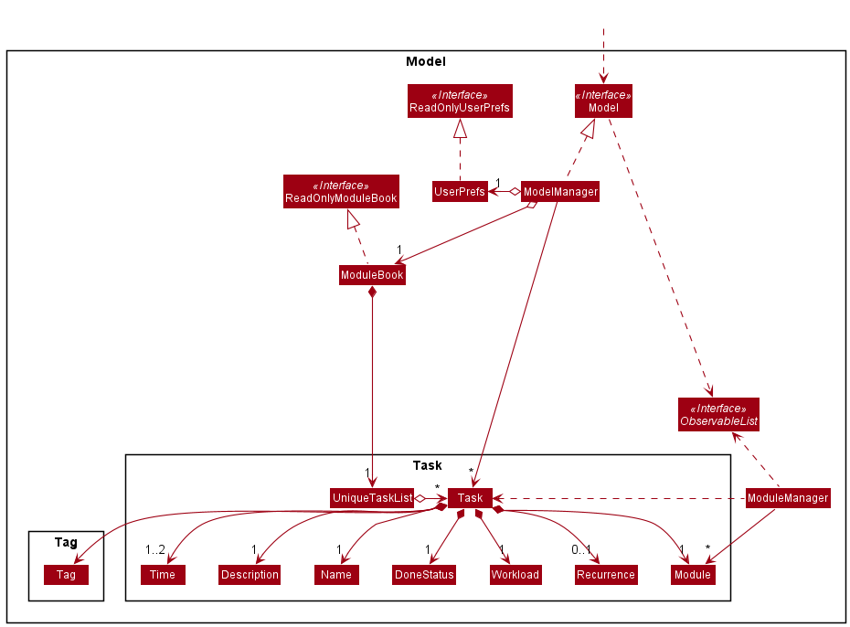

**API** : [`Model.java`](https://github.com/se-edu/modulebook-level3/tree/master/src/main/java/seedu/module/model/Model.java)

The `Model`,

* stores a `UserPref` object that represents the user’s preferences.
* stores the module book data.
* exposes an unmodifiable `ObservableList<Task>` that can be 'observed' e.g. the UI can be bound to this list so that the UI automatically updates when the data in the list change.
* does not depend on any of the other three components.

:information_source: **Note:** An alternative (arguably, a more OOP) model is given below. It has a `Tag` list in the `ModuleBook`, which `Task` references. This allows `ModuleBook` to only require one `Tag` object per unique `Tag`, instead of each `Task` needing their own `Tag` object. 

### Storage component

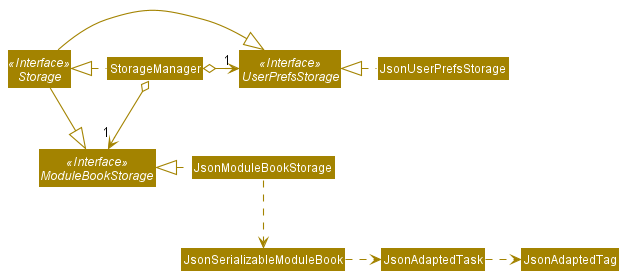

**API** : [`Storage.java`](https://github.com/se-edu/modulebook-level3/tree/master/src/main/java/seedu/module/storage/Storage.java)

The `Storage` component,
* can save `UserPref` objects in json format and read it back.
* can save the module book data in json format and read it back.

### Common classes

Classes used by multiple components are in the `seedu.modulebook.commons` package.

--------------------------------------------------------------------------------------------------------------------

## **Implementation**

This section describes some noteworthy details on how certain features are implemented.

### Done/notdone feature

#### Implementation

The done/notdone mechanism is facilitated by `Task`. It extends `Task` with a done status, stored internally as a `DoneStatus`. Additionally, it implements the following operations:

* `Task#setDoneStatus(task, doneStatus)` —  Creates a copy of `task` that has new `doneStatus`.

Given below is an example usage scenario and how the done mechanism behaves at each step.

Step 1. The user launches the application for the first time. The `ModuleBook` will be initialized with the initial module book state, and the `currentStatePointer` pointing to that single module book state.

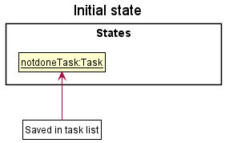

Step 2. The user executes `done 5` command to mark the 5th task in the module book as done. The `done` command calls `Task#setDoneStatus(task, doneStatus)`, causing the modified copy of the selected task after the `done 5` command executes to be saved in the `tasks` list.

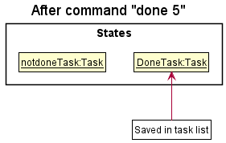

:information_source: **Note:** If the done command fails its execution, it will not call `Task#setDoneStatus(task, doneStatus)`, so the modified copy of the task will not be saved into the `tasks` list.

The following sequence diagram shows how the done operation works:

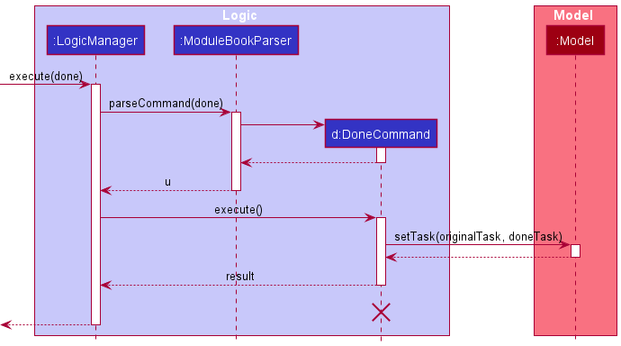

:information_source: **Note:** The lifeline for `DoneCommand` should end at the destroy marker (X) but due to a limitation of PlantUML, the lifeline reaches the end of diagram.

The following activity diagram summarizes what happens when a user executes done command:

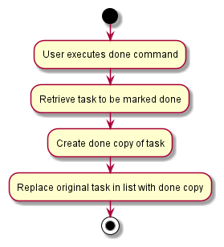

The notdone mechanism is similar to that of the done mechanism, except that the modified copy of the task is set as not done instead.

### \[Proposed\] Undo/redo feature

#### Proposed Implementation

The proposed undo/redo mechanism is facilitated by `VersionedModuleBook`. It extends `ModuleBook` with an undo/redo history, stored internally as an `moduleBookStateList` and `currentStatePointer`. Additionally, it implements the following operations:

* `VersionedModuleBook#commit()` — Saves the current module book state in its history.
* `VersionedModuleBook#undo()` — Restores the previous module book state from its history.
* `VersionedModuleBook#redo()` — Restores a previously undone module book state from its history.

These operations are exposed in the `Model` interface as `Model#commitModuleBook()`, `Model#undoModuleBook()` and `Model#redoModuleBook()` respectively.

Given below is an example usage scenario and how the undo/redo mechanism behaves at each step.

Step 1. The user launches the application for the first time. The `VersionedModuleBook` will be initialized with the initial module book state, and the `currentStatePointer` pointing to that single module book state.

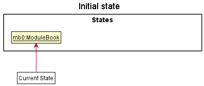

Step 2. The user executes `delete 5` command to delete the 5th task in the module book. The `delete` command calls `Model#commitModuleBook()`, causing the modified state of the module book after the `delete 5` command executes to be saved in the `moduleBookStateList`, and the `currentStatePointer` is shifted to the newly inserted module book state.

Step 3. The user executes `add n/David …​` to add a new task. The `add` command also calls `Model#commitModuleBook()`, causing another modified module book state to be saved into the `moduleBookStateList`.

:information_source: **Note:** If a command fails its execution, it will not call `Model#commitModuleBook()`, so the module book state will not be saved into the `moduleBookStateList`.

Step 4. The user now decides that adding the task was a mistake, and decides to undo that action by executing the `undo` command. The `undo` command will call `Model#undoModuleBook()`, which will shift the `currentStatePointer` once to the left, pointing it to the previous module book state, and restores the module book to that state.

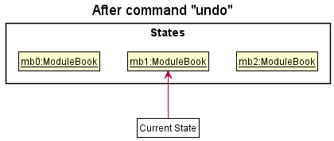

:information_source: **Note:** If the `currentStatePointer` is at index 0, pointing to the initial ModuleBook state, then there are no previous ModuleBook states to restore. The `undo` command uses `Model#canUndoModuleBook()` to check if this is the case. If so, it will return an error to the user rather
than attempting to perform the undo.

The following sequence diagram shows how the undo operation works:

:information_source: **Note:** The lifeline for `UndoCommand` should end at the destroy marker (X) but due to a limitation of PlantUML, the lifeline reaches the end of diagram.

The `redo` command does the opposite — it calls `Model#redoModuleBook()`, which shifts the `currentStatePointer` once to the right, pointing to the previously undone state, and restores the module book to that state.

:information_source: **Note:** If the `currentStatePointer` is at index `moduleBookStateList.size() - 1`, pointing to the latest module book state, then there are no undone ModuleBook states to restore. The `redo` command uses `Model#canRedoModuleBook()` to check if this is the case. If so, it will return an error to the user rather than attempting to perform the redo.

Step 5. The user then decides to execute the command `list`. Commands that do not modify the module book, such as `list`, will usually not call `Model#commitModuleBook()`, `Model#undoModuleBook()` or `Model#redoModuleBook()`. Thus, the `moduleBookStateList` remains unchanged.

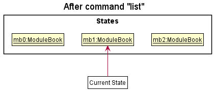

Step 6. The user executes `clear`, which calls `Model#commitModuleBook()`. Since the `currentStatePointer` is not pointing at the end of the `moduleBookStateList`, all module book states after the `currentStatePointer` will be purged. Reason: It no longer makes sense to redo the `add n/David …​` command. This is the behavior that most modern desktop applications follow.

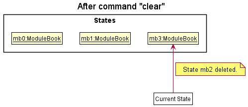

The following activity diagram summarizes what happens when a user executes a new command:

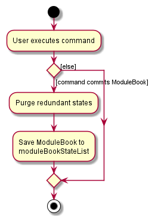

#### Design consideration:

##### Aspect: How undo & redo executes

* **Alternative 1 (current choice):** Saves the entire module book.
  * Pros: Easy to implement.
  * Cons: May have performance issues in terms of memory usage.

* **Alternative 2:** Individual command knows how to undo/redo by
  itself.
  * Pros: Will use less memory (e.g. for `delete`, just save the task being deleted).
  * Cons: We must ensure that the implementation of each individual command are correct.

_{more aspects and alternatives to be added}_

--------------------------------------------------------------------------------------------------------------------

## **Documentation, logging, testing, configuration, dev-ops**

* [Documentation guide](Documentation.md)
* [Testing guide](Testing.md)
* [Logging guide](Logging.md)
* [Configuration guide](Configuration.md)
* [DevOps guide](DevOps.md)

--------------------------------------------------------------------------------------------------------------------

## **Appendix: Requirements**

### Product scope

**Target user profile**:

* NUS Computer Science student
* In his/her second year of studies
* Taking tough CS modules (e.g. CS3230, CS2106, CS2103T)
* Requires organization of tasks pertaining to the modules he/she is taking
* Prefers to use the keyboard compared to a mouse
* Is reasonably comfortable using CLI apps

**Value proposition**: manage module related tasks faster than a typical mouse/GUI driven app

### User stories

Priorities: High (must have) - `* * *`, Medium (nice to have) - `* *`, Low (unlikely to have) - `*`

| Priority | As a …​                                 | I want to …​                               | So that I can…​                                                                |
| -------- | ------------------------------------------ | --------------------------------------------- | --------------------------------------------------------------------------------- |
| `* * *`  | student                                    | add task to list                              | keep track of my module-related tasks and stay organized                    |
| `* * *`  | student                                    | delete a task from the list                   | remove the tasks I have completed or don't want anymore                           |
| `* *`    | meticulous student                         | mark a task as done                           | keep track of tasks that I have completed                                         |
| `* *`    | student                                    | mark a task as undone                         | keep track of tasks that I've yet to complete or need to make edits to            |
| `*`      | student                                    | tag tasks                                     | filter through my tasks easily and focus on the similar ones with the same tags   |
| `*`      | user with many tasks in the module book    | modify the deadline without deleting the task | waste less time recreating the whole task                                         |
| `*`      | user with many tasks in the module book    | modify the deadline without deleting the task | waste less time recreating the whole task     
| `*`      | user with many tasks in the module book    | sort the tasks by deadline                    | see which tasks need to be addressed as soon as possible
| `*`      | user with many tasks in the module book    | sort the tasks by workload                    | see which tasks require more effort to complete
| `*`      | busy student                               | view workload count for each module           | decide which module requires more effort
| `*`      | busy student                               | search for tags                               | locate my tasks easily                                                            |
| `*`      | busy student                               | delete tags                                   | edit tags of my tasks without having to recreate them                             |
| `*`      | busy student with many repeating tasks     | make a task repeat daily, monthly or weekly   | avoid keying in the same task daily or weekly or monthly                     |                              

### Use cases

(For all use cases below, the **System** is the `ModuleBook` and the **Actor** is the `user`, unless specified otherwise)

**Use case 01: List all tasks**

**MSS**

1.  User requests to see all tasks.

2.  ModuleBook3.5 presents tasks in list form.

 **Extensions**
* 2a. The list is empty.
    Use case ends.
    
**Use case 02: Delete a task**

**MSS**

1.  User <ins>lists tasks (UC01)</ins>.

2.  User requests to delete a specific task in the list.

3.  ModuleBook3.5 deletes the task.

4.  ModuleBook3.5 updates the workload count for the relevant module.

    Use case ends.

**Extensions**

* 2a. The list is empty.

  Use case ends.
  
* 3a. The given index is out of range.

    * 3a1. ModuleBook3.5 shows an error message.

      Use case resumes at step 2.
      

**Use case 03: Mark task as done**

**MSS**

1.  User <ins>lists tasks (UC01)</ins>.

2.  User requests to mark a task as done.

3.  ModuleBook3.5 marks the task as done.

    Use case ends.

**Extensions**

* 2a. The list is empty.

    * 2a1. ModuleBook3.5 shows an error message. 
      
      Use case ends.

* 3a. The given index is out of range.

    * 3a1. ModuleBook3.5 shows an error message.

      Use case resumes at step 2.

* 3b. The task at given index is already done.

    * 3b1. ModuleBook3.5 shows an already done message.

      Use case resumes at step 2.

**Use case 04: Mark task as not done**

**MSS**

1.  User <ins>lists tasks (UC01)</ins>.

2.  User requests to mark a task as not done.

3.  ModuleBook3.5 marks the task as not done.

    Use case ends.

**Extensions**

* 2a. The list is empty.

    * 2a1. ModuleBook3.5 shows an error message.

      Use case ends.
    

* 3a. The given index is out of range.

    * 3a1. ModuleBook3.5 shows an error message.

      Use case resumes at step 2.

* 3b. The task at given index is not done yet.

    * 3b1. ModuleBook3.5 shows a not done message.
    

**Use case 05: Add a task**

**MSS**

1.  User keys in task details in the input field.

2.  User request to add a task.
    
3.  ModuleBook3.5 adds the task into the user’s list of tasks.

4.  ModuleBook3.5 updates the workload count for the relevant module.

**Extensions**

* 2a. The exact task with the same name and module code is already present in the list.

    * 2a1. ModuleBook3.5 displays an error message indicating task is present.
      
      Use case resumes at step 2.

* 2b.  Invalid format for the add command.

    * 2b1. ModuleBook3.5 shows an error message with the correct format for add and example.

      Use case resumes at step 2.
      
* 2c.  The start time of the task is later than its deadline.
      
    * 2c1. ModuleBook3.5 shows an error message.
      
      Use case resumes at step 2.

**Use case 06: Tag a task**

**MSS**

1.  User <ins>lists tasks (UC01)</ins>.
    
2.  User requests to add a tag to a task.
    
3.  ModuleBook3.5 adds tag to task.

    Use case ends.
    
**Extensions**

* 2a. The list is empty.

    * 2b1. ModuleBook3.5 shows an error message.

      Use case resumes at step 2.

* 2b. The given index is out of range.

    * 2b1. ModuleBook3.5 shows an error message.

      Use case resumes at step 2.

* 2c. The task at given index has the tag already.

   Use case resumes at step 2.

**Use case 07: Search a tag**

**MSS**

1.  User request to search for a task by inputing a tag.

2.  ModuleBook3.5 find the tag and display all tasks with the tag.

    Use case ends.

**Extensions**

* 2a. Tag not found.

    * 2a1. ModuleBook3.5 shows an error message.

      Use case ends.

**Use case 08: Search a task**

**MSS**

1.  User request to search a task by inputting a name.

2.  ModuleBook3.5 find the name and display all tasks with the name.

    Use case ends.

**Extensions**

* 2a. Name not found.

    * 2a1. ModuleBook3.5 shows an error message.

      Use case ends.
    
**Use case 09: Delete a tag**

**MSS**

1.  User <ins>lists tasks (UC01)</ins>.

2.  User requests to delete a specific Tag of a Task in the list.

3.  ModuleBook3.5 deletes the Tag.

    Use case ends.

**Extensions**

* 2a. The list is empty.

  Use case ends.

* 3a. The given index is out of range.

    * 3a1. ModuleBook3.5 shows an error message.

      Use case resumes at step 2.
    
* 3b. Tag does not exist.
  
    * 3b1. ModuleBook3.5 shows an error message.
    
      Use case resumes at step 2.
    

**Use case 10: Edit a task**

**MSS**

1.  User <ins>lists tasks (UC01)</ins>.

2.  User requests to edit a task’s details.

3.  ModuleBook3.5 changes task details.

4.  ModuleBook3.5 updates workload count for the relevant module.

    Use case ends.

**Extensions**

* 2a. Invalid format for the edit command.

    * 2a1. ModuleBook3.5 shows an error message with the correct format for edit and example.

      Use case resumes at step 2.
    
* 2b. Detail to be edited is the same as original detail.

    * 2b1. ModuleBook3.5 shows an error message stating that detail need not be changed. 
      
      Use case resumes at step 2.
    
* 2c. No edit inputs given.

    * 2c1. ModuleBook3.5 shows an error message stating that there are no changes in the first place. 
      
      Use case resumes at step 2.
    
* 2d. The given index is out of range.

    * 2d1. ModuleBook3.5 shows an error message.

      Use case resumes at step 2.

* 2e.  The start time of the edited task is later than its deadline.
      
    * 2e1. ModuleBook3.5 shows an error message.
      
      Use case resumes at step 2.
    

**Use case 11: Search tasks by Module**

**MSS**

1.  User request to search for tasks by inputting a module code.

2.  ModuleBook3.5 finds the tasks associated to the module code and display them.

    Use case ends.

**Extensions**

* 2a. Module code not found.

    * 2a1. ModuleBook3.5 shows an error message.

      Use case ends.
      
      
**Use case 12: Sorts tasks by Deadline**

**MSS**

1.  User request to sorts tasks by deadline.

2.  ModuleBook3.5 sorts the tasks in descending order of urgency and display them.

    Use case ends.

**Extensions**

* 2a. Invalid format for the sort command.

    * 2a1. ModuleBook3.5 shows an error message with the correct format for sort and example.

      Use case resumes at step 2.
    
**Use case 13: Recur tasks**

**MSS**

1.  User <ins>lists tasks (UC01)</ins>.

2. User requests to add a recurrence to a task.

3. ModuleBook3.5 adds recurrence to the task requested to be recurred by the user.

Use case ends.

**Extensions**

* 2a. The given index is out of range.

    * 2a1. ModuleBook3.5 shows an error  message.
    
        Use case resumes at step 2.

* 2b. The recurrence is not daily, weekly or monthly.

    * 2b1. ModuleBook3.5 shows an error message.
        
        Use case resumes at step 2.
        
* 2c. The recurrence inputted is the same as the defined recurrence of the task.
    
    * 2c1. ModuleBook3.5 shows an error message.
    
        Use case resumes at step 2.

### Non-Functional Requirements

1.  Should work on any _mainstream OS_ as long as it has Java `11` or above installed.
2.  Should be able to hold up to 1000 tasks without a noticeable sluggishness in performance for typical usage.
3.  A user with above average typing speed for regular English text (i.e. not code, not system admin commands) should be able to accomplish most of the tasks faster using commands than using the mouse.
4.  The size of ModuleBook3.5 will not be larger than 20 MB.
5.  The project is expected to adhere to a schedule that delivers a feature set every two weeks until the end of April.

### Glossary

* **Mainstream OS**: Windows, Linux, Unix, OS-X
* **Module**: A subject in NUS

--------------------------------------------------------------------------------------------------------------------

## **Appendix: Instructions for manual testing**

Given below are instructions to test the app manually.

:information_source: **Note:** These instructions only provide a starting point for testers to work on;
testers are expected to do more *exploratory* testing.

### Launch and shutdown

1. Initial launch

   1. Download the jar file and copy into an empty folder

   1. Double-click the jar file Expected: Shows the GUI with a set of sample contacts. The window size may not be optimum.

1. Saving window preferences

   1. Resize the window to an optimum size. Move the window to a different location. Close the window.

   1. Re-launch the app by double-clicking the jar file. 
       Expected: The most recent window size and location is retained.

1. _{ more test cases …​ }_

### Deleting a task

1. Deleting a task while all tasks are being shown

   1. Prerequisites: List all tasks using the `list` command. Multiple tasks in the list.

   1. Test case: `delete 1` 
      Expected: First task is deleted from the list. Details of the deleted task shown in the status message. Timestamp in the status bar is updated.

   1. Test case: `delete 0` 
      Expected: No task is deleted. Error details shown in the status message. Status bar remains the same.

   1. Other incorrect delete commands to try: `delete`, `delete x`, `...` (where x is larger than the list size) 
      Expected: Similar to previous.

1. _{ more test cases …​ }_

### Saving data

1. Dealing with missing/corrupted data files

   1. _{explain how to simulate a missing/corrupted file, and the expected behavior}_

1. _{ more test cases …​ }_
