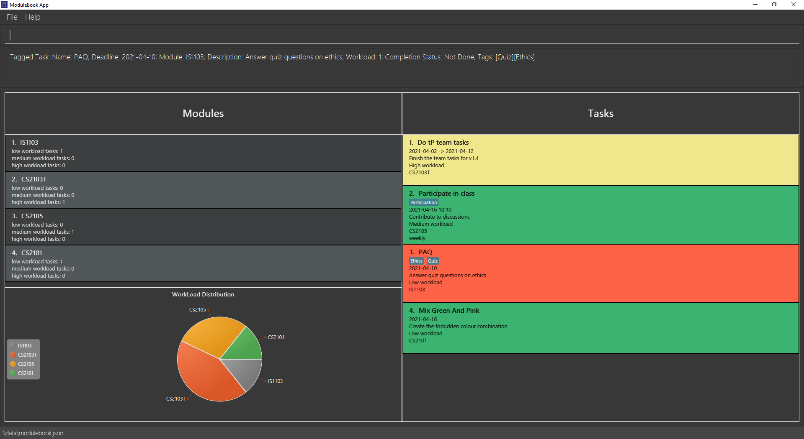
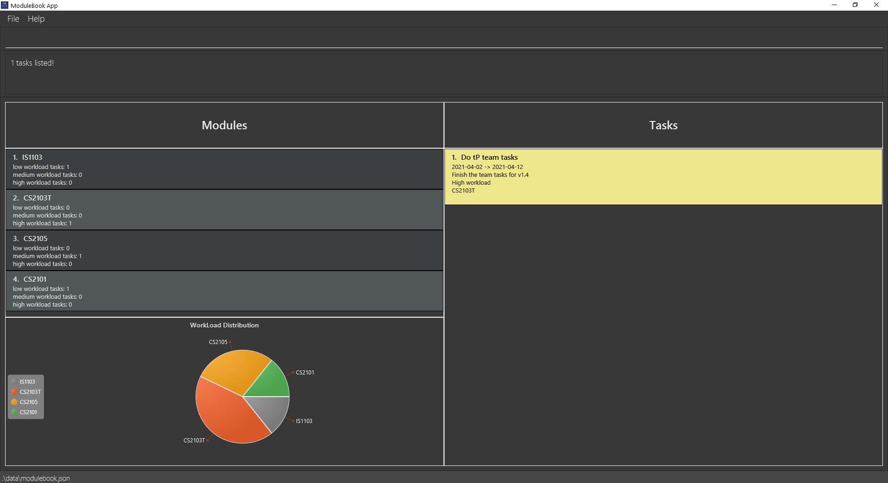
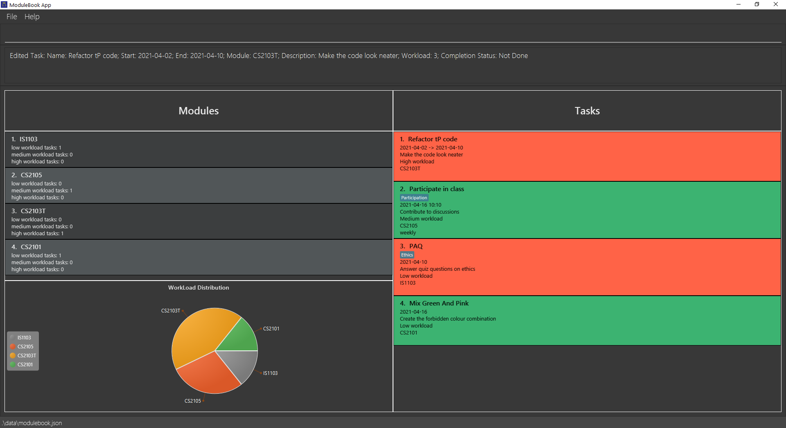
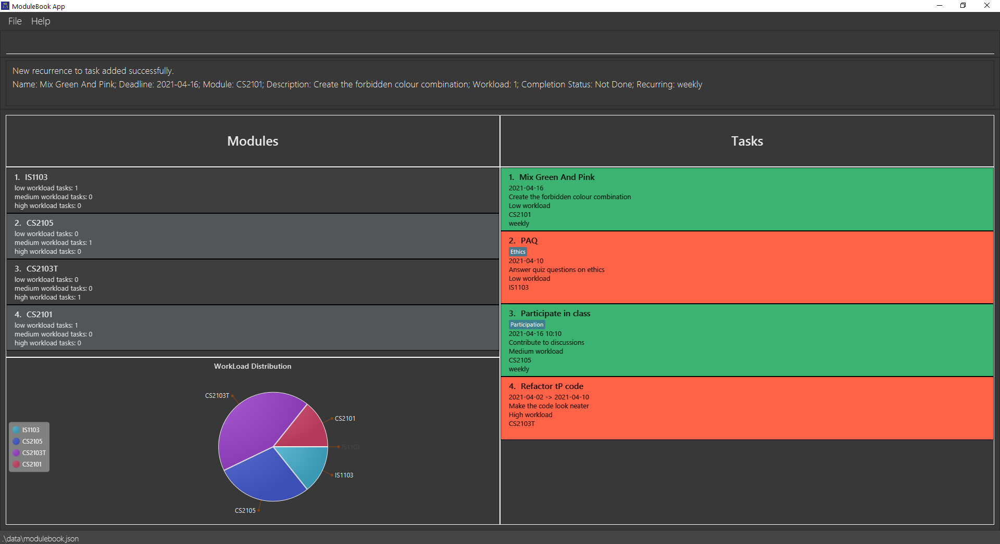

ModuleBook3.5 is the go-to tool for busy students/professionals who are confident that typing can save them time. 
Using ModuleBook3.5, one can organise and keep track of tasks and their deadlines in an 
Easy, Seamless and Straightforward manner, all without the need for consistent internet connection. 
Even if your online learning portal fails, you can still see your task details
on ModuleBook3.5.

* Table of Contents
{:toc}
  

--------------------------------------------------------------------------------------------------------------------

## Quick start

1. ModuleBook3.5 can run on a computer installed with a major operating system (e.g. Windows/Mac/Linux) and Java 11.

1. First, download the jar file for the latest release from [github](https://github.com/AY2021S2-CS2103T-T13-2/tp/releases)

1. Once the jar file is ready, simply double-click the file in the download section.

1. Refer to the [Commands](#commands) below for details of each command.

--------------------------------------------------------------------------------------------------------------------

## Features

1. At the top of the display is a toolbar to either exit the app (under `File`) 
   or access this user guide (under `Help`).
   
1. Below the toolbar is a command line to key in any of the below commands. 
   The result is displayed in a box underneath this command line.
   
1. A list of modules for which tasks are available is also shown.
    1. For each module, the number of tasks across each workload rating is displayed.
    1. The distribution of workload across all modules is calculated and displayed on a pie chart.
    

:exclamation: **Alert:**
Within the workload pie chart, each module's colour may change as a command is executed. 
However, the colours will be arranged such that no two modules with the same colour will be next to each other.

1. Tasks are colour coded based on done status. 
   1. Done tasks are coloured pink. 
   1. Tasks that are not done are classified into 4 different categories (colors):
   1. Color | Time to deadline
      --------|------------------
      **Green** | More than 3 days
      **Yellow** | Between 1 to 3 days
      **Orange** | Less than 1 day      
      **Purple** | Expired
   
1. The pie chart is used to show workload distribution.
   1. The color of pie chart is randomly assigned.
   2. The workload of each module is counted using the tasks of such module inclunding those that are already done and those that are not finished yet.
    
1. You can rate a task's expected workload using the following mapping:
   
   Input Parameter | Workload Rating
   --------|------------------
   **w/1** | Low
   **w/2** | Medium
   **w/3** | High
   E.g. for a low workload rating, key in `w/1`.
   
1. The following module codes are supported 
   (Note that subject description may differ from actual module name):

    Module Code | Subject Description
    --------|------------------
    CS1101S | Programming Methodology 
    CS1010S | Programming Methodology in Python
    CS1231S | Discrete Structures
    CS2030 | Programming Methodology II
    CS2040S | Data Structures and Algorithms
    CS2101 | Effective Communication for Computing Professionals
    CS2103T | Software Engineering
    CS2105 | Introduction to Computer Networks
    CS2106 | Introduction to Operating Systems
    CS3103 | Computer Networks Practice
    CS3210 | Parallel Computing
    CS3212 | Programming Languages
    CS3217 | Software Engineering on Modern Application Platforms
    CS3219 | Software Engineering Principles and Patterns
    CS3220 | Computer Architecture
    CS3223 | Database Systems Implementation
    CS3225 | Combinatory Methods in Bioinformatics
    CS3230 | Design and Analysis of Algorithm
    CS3231 | Theory of Computation
    CS3233 | Competitive Programming
    CS3243 | Introduction to Artificial Intelligence
    CS3244 | Machine Learning
    IS1103 | Computing Ethics
    ST2131 | Probability
    If your module code does not appear in the above table, 
    you may use a substitute module code based on the subject description.
  

--------------------------------------------------------------------------------------------------------------------

## Commands

**:information_source: Notes about the command format:** 

* Words in `UPPER_CASE` are parameters to be supplied by you. 
  e.g. in `add d/DESCRIPTION`, `DESCRIPTION` is a parameter which can be used as `add d/DESCRIPTION`.

* Parameters in square brackets are optional. Parameters without square brackets are compulsory.  
  e.g. `d/DESCRIPTION [t/TAG]` can be used as `d/CS3243 Assignment4 t/Minimax` or as `d/CS3243 Assignment4`.
  
* For commands that take in an `INDEX`, only one index is to be supplied. 
  e.g. `delete 1` will work but `delete 1 3` (2 indices) will not.

* For `MODULE`, the letters in module code should be upper-case. 
  e.g. `CS2103T` and not `cs2103t`.
  
* For `START TIME` and `DEADLINE`, the accepted date-time formats are: yyyy-MM-dd HH:mm or yyyy-MM-dd (HH:mm taken as current time). 
  e.g. `2021-03-21 10:10` or `2021-03-21`.

* Items with `…`​ after them can be used multiple times including zero times. 
  e.g. `[t/TAG]…​` can be used as ` ` (i.e. 0 times), `t/Minimax`, `t/Minimax t/CSP` etc.

* Parameters can be in any order. 
  e.g. if the command specifies `d/DESCRIPTION t/TAG`, `t/TAG d/DESCRIPTION` is also acceptable.
  
* If a parameter is expected only once in the command but you specified it multiple times, 
  only the last occurrence of the parameter will be taken. Please refer to [Duplicate Parameters](#Duplicate Parameters). 
  e.g. if you specify `d/CS2103T team project for week7 d/CS3243 Assignment 4`, only `d/CS3243 Assignment 4` will be taken.

* Extraneous parameters for commands that do not take in parameters (such as`list`) will be ignored. 
  e.g. if the command specifies `list 123`, it will be interpreted as `list`.

### Command list

   * **`list`** : List out tasks

   * **`add`** : Add a task

   * **`clear`** : Delete all tasks

   * **`delete`** : Delete a task

   * **`done`** : Mark a task as done

   * **`notdone`** : Mark a task as not done

   * **`tag`** : Add a tag to a task

   * **`find`** : Search for tasks with name

   * **`findTag`** : Search for tasks with tag
     
   * **`deleteTag`** : Delete a tag of a task

   * **`mod`** : Search for tasks of a specific module

   * **`edit`** : Edit task

   * **`sort`** : Sort tasks
   
   * **`recur`** : Recur tasks
   
   * **`refresh`** : Refresh all showing tasks

   * **`exit`** : Close the app

### Parameter Prefixes
Below is a table of prefixes mapped to the respective parameters: 

 Prefix | Parameter | How to Remember 
--------|----------|-------------
n/ | NAME | 
m/ | MODULE | 
d/ | DESCRIPTION | 
a/ | START TIME | "start AT"
b/ | DEADLINE | "finish BY"
w/ | WORKLOAD |
r/ | RECURRENCE |
t/ | TAG |

### Duplicate Parameters
1. Most commands take in only one instance of a unique parameter. In such cases, the last instance of the parameter is accepted.

1. E.g. For `edit 1 m/CS2103T m/CS2101`, `m/CS2101` is taken as the argument for `MODULE`.

1. All other preceding arguments of the same parameter (including invalid ones) will be ignored.
   In the above example, `m/CS2103T` is ignored.

1. However, if the last argument happens to be invalid, the command will not execute. 
   E.g. for `edit 1 m/CS2101 m/Invalid`, `m/Invalid` will be taken as the module argument, which is invalid. Even though m/CS2101 is valid, it is ignored entirely.

--------------------------------------------------------------------------------------------------------------------

### List out tasks : `list`

Shows a list of all tasks you have added.

Format: `list`

### Add a task: `add`

Adds a task to ModuleBook3.5. All newly added tasks are not done by default.

Application: Used to add new tasks for tracking purposes.

Format: `add n/TASK NAME m/MODULE d/DESCRIPTION [a/START TIME] b/DEADLINE w/WORKLOAD [r/RECURRENCE] [t/TAG]…​`

* If you wish to include a start time for your task, the start time should not be later than deadline.

* Recurrence should be either "daily", "weekly" or "biweekly".

* Enter the time you wish to complete your task in the format: yyyy-MM-dd HH:mm or yyyy-MM-dd (HH:mm set to 00:00)

Examples:
* `add n/v1.2 TP m/CS2103T d/implement basic features b/2021-03-13 23:59 w/3 t/urgent`
* `add n/practice sets m/CS3230 d/practice master's theorem a/2021-03-14 00:00 b/2021-03-15 00:00 w/1 r/weekly`

### Delete a task : `delete`

Deletes the specified task from the module book.

Application: Used to remove tasks when tracking them is no longer necessary.

Format: `delete INDEX`

* Deletes the task at the specified `INDEX`.
* The index refers to the index number shown in the displayed task list.
* The index **must be a positive integer** 1, 2, 3, …​

Examples:
* `list` followed by `delete 2` deletes the 2nd task in the ModuleBook3.5.
* `find CS2103T` followed by `delete 1` deletes the 1st task in the results of the `find` command.

### Delete all tasks: `clear`

Deletes all tasks from the module book.

Application: Used to clear out module book after a school term ends.

Format: `clear`

### Mark a task as done : `done`

Mark an existing task as done. Done tasks are coloured green.

Application: Used to indicate task is completed and does not need any attention at the moment.

Format: `done INDEX`

* Mark the task as done at the specified `INDEX`.
* The index refers to the index number shown in the displayed task list.
* The index **must be a positive integer** 1, 2, 3, …​

Examples:
* `list` followed by `done 2` marks the 2nd task as done in the ModuleBook3.5.
* `find Quiz` followed by `done 1` marks the 1st task in the results of the `find` command as done.

### Mark a task as not done : `notdone`

Mark an existing task as not done. Not done tasks are coloured pink.

Application: Used to indicate task may need to be re-attempted.

Format: `notdone INDEX`

* Mark the task as not done at the specified `INDEX`.
* The index refers to the index number shown in the displayed task list.
* The index **must be a positive integer** 1, 2, 3, …​

Examples:
* `list` followed by `notdone 2` marks the 2nd task as not done in the ModuleBook3.5.
* `find Quiz` followed by `notdone 1` marks the 1st task in the results of the `find` command as not done.

### Add tag(s): `tag`

Adds a tag or multiple tags to a task.

Application: Used to briefly indicate the nature of the task.

Format: `tag INDEX t/TAG [t/MORETAGS]...​` 

* Attaches one or more tags to the task associated with INDEX. Tags can be used to identify related tasks.
* If only `/t` is provided without preceding value, no tag will be added but MB3.5 will show you the existing tags
associated to the task you tried to tag.

Examples:
* `tag 1 t/SoftwareEng`

### Search tasks with name of task: `find`

Searches for tasks with a name of task  provided.

Application: Used to find a certain task that may be further down the list.

Format: `find KEYWORD`

* Searches through ModuleBook3.5 for tasks whose names contain `KEYWORD`.

Examples:
* `find revise`

### Search tasks with tag: `findTag`

Searches for tasks with an associated tag. Tag is case-insensitive for your convenience.

One Tag allowed. Tag provided must be alphanumerical.

Application: Used to find tasks that are similar in nature.

Format: `findTag KEYWORD`

* Searches through ModuleBook3.5 for tasks which have a tag named `KEYWORD`.

Examples:
* `findTag homework`

### Search tasks associated to a Module: `mod`

Searches for tasks of a specific Module.

Application: Used to find tasks from one Module.

Format: `mod MODULE`

* Searches through ModuleBook3.5 for tasks which belong to `MODULE`.

Examples:
* `mod CS3243`

### Delete tag of Task: `deleteTag`

Deletes a tag from its associated task. Note that tags are case-sensitive.

Application: Used to remove a tag without the need to reset all other tags.

Format: `deleteTag INDEX t/TAG`

* Deletes the task at the specified `INDEX`. 
  The index refers to the index number shown in the displayed task list. 
  The index must be a positive integer 1, 2, 3, …​

Examples:
* `deleteTag 1 t/homework`

### Edit a task: `edit`

Edits an existing task in the module book.

Application: Used to change details of a task without the need to delete them.

Format: `edit INDEX [n/NAME] [m/MODULE] [d/DESCRIPTION] [a/START TIME] [b/DEADLINE] [w/WORKLOAD] [r/RECURRENCE] [t/TAG] …​`

* Edits the task at the specified `INDEX`. The index refers to the index number shown in the displayed task list. The index **must be a positive integer** 1, 2, 3, …​
* At least one of the optional fields must be provided.
* Recurrence should be either "daily", "weekly" or "biweekly".
* Existing values will be updated to the input values.
* If you wish to include a start time for your task, the start time should not be later than deadline.
* Editing tags through the `edit` command overrides all existing tags. If you wish to add or delete only certain tags, use `tag` and `deleteTag` commands instead.

Examples:
*  `edit 1 d/Eat Biscuits` Edits the description of the 1st task to `Eat Biscuits`.
*  `edit 2 d/Eat Biscuits b/2021-03-21 10:10` Edits the description of the 2nd task to be `Eat Biscuits` and its deadline to date `2021-03-21 10:10`.
*  `edit 2 b/2021-03-25` Edits the deadline of the 3rd task to `2021-03-25`

### Sort tasks : `sort`

Sorts the list of all tasks by one attribute of the tasks. If no prefix is supplied, the tasks will be sorted by deadline.

Application: Used to group and prioritise tasks based on a certain criteria.

Format:  `sort` or `sort n/` or `sort d/` or `sort m/` or `sort w/` or `sort b/` or `sort t/` 

*  `sort n/` Sorts the tasks by name alphabetically in ascending order.
*  `sort d/` Sorts the tasks by description alphabetically in ascending order.
*  `sort w/` Sorts the tasks by workload in descending order.
*  `sort` or `sort b/` Sorts the tasks by deadline so that the the task with closer the deadline in the list, the higher the task.
*  `sort m/` Sorts the tasks by module code alphabetically in descending order.
*  `sort t/` Sorts the tasks by number of tags in descending order.

Examples:
* `sort w/`

### Recur tasks: `recur`

Recurs a task either daily, biweekly or weekly or removes the recurrence of the task.

Application: Used to reset the recurring task deadline and done status when appropriate without having to manually edit the task.

Format: `recur INDEX r/RECURRENCE`

* Recurs the task at the specified `INDEX`.
* `INDEX` refers to the index number displayed in ModuleBook3.5.
   It must be a positive integer.
* `RECURRENCE` refers to the regularity of the task that recurs periodically.
* `RECURRENCE` can only be `daily`, `weekly` or `biweekly` if a task needs to be recurred.
* `RECURRENCE` should be left empty if the recurrence of a task needs to be removed.
   The prefix `r/` must still be used.

Examples:
* `recur 1 r/biweekly` Recurs the 1st task in ModuleBook3.5 every two weeks.
* `recur 2 r/weekly` Recurs the 4th task in ModuleBook3.5 every week.
* `recur 3 r/daily` Recurs the 3rd task in ModuleBook3.5 every day.
* `recur 4 r/` Removes the recurrence of the 4th task in ModuleBook3.5.

### Refresh all tasks: `refresh`

Refreshes the current list that is showing, updates the deadline if necessary.

Format: `refresh`

### Close app: `exit`

Closes the app.

Application: Used to exit the app. You may also click the close button or the `Exit` button under `File` in the toolbar.

Format: `exit`

--------------------------------------------------------------------------------------------------------------------

### Save data

ModuleBook3.5 data is saved in the hard disk automatically after any command that changes the data. There is no need to save manually.

--------------------------------------------------------------------------------------------------------------------

### Edit the data file

ModuleBook3.5 data is saved as a JSON file `[JAR file location]/data/modulebook.json`. Advanced users are welcome to update data directly by editing that data file.

:exclamation: **Caution:**
If your changes to the data file makes its format invalid, ModuleBook3.5 will discard all data and start with an empty data file at the next run.

--------------------------------------------------------------------------------------------------------------------

## FAQ
**Q**: I tried double-clicking the jar file but it did not open. What happened? 
**A**: Try checking if any security software is blocking the jar file. If that still does not work, navigate to command prompt and run the following command:
`java -jar modulebook.jar`

**Q**: How do I transfer my data to another Computer? 
**A**: Install the app in the other computer and overwrite the empty data file it creates with the file that contains the data of your previous ModuleBook3.5 home folder.

--------------------------------------------------------------------------------------------------------------------

## Command summary

Action | Format, Examples
--------|------------------
**list** | `list`
**add** | `add n/TASK NAME m/MODULE d/DESCRIPTION [a/START TIME] b/DEADLINE w/WORKLOAD [r/RECURRENCE] [t/TAG]…​`   e.g. `add n/TP m/CS2103T d/Team tasks b/2021-01-20 20:00 w/3 t/tagname`
**delete** | `delete INDEX`  e.g. `delete 3`
**clear** | `clear`
**deleteTag** | `deleteTag INDEX [t/TAG NAME]`  e.g. `delete 3 [t/SoftwareEng]`
**done** | `done INDEX`  e.g. `done 1`
**notdone** | `notdone INDEX`  e.g. `notdone 1`
**tag** | `tag INDEX [t/TAG NAME]`  e.g. `tag 1 [t/SoftwareEng]`
**find** | `find KEYWORD`  e.g. `find Assignment`
**findTag** | `findTag KEYWORD`  e.g. `find Assignment`
**mod** | `mod MODULE`  e.g. `mod CS2103T`
**edit** | `edit INDEX [d/DESCRIPTION] [b/DEADLINE]…​`  e.g. `edit 2 d/Eat Biscuits b/2021-03-21 10:10`
**recur** | `recur INDEX r/RECURRENCE`  e.g. `recur 1 r/biweekly`
**refresh** | `refresh`
**sort** | `sort n/` or `sort d/` or `sort m/` or `sort w/` or `sort b/` or `sort t/`   e.g. `sort b/`
**exit** | `exit`
